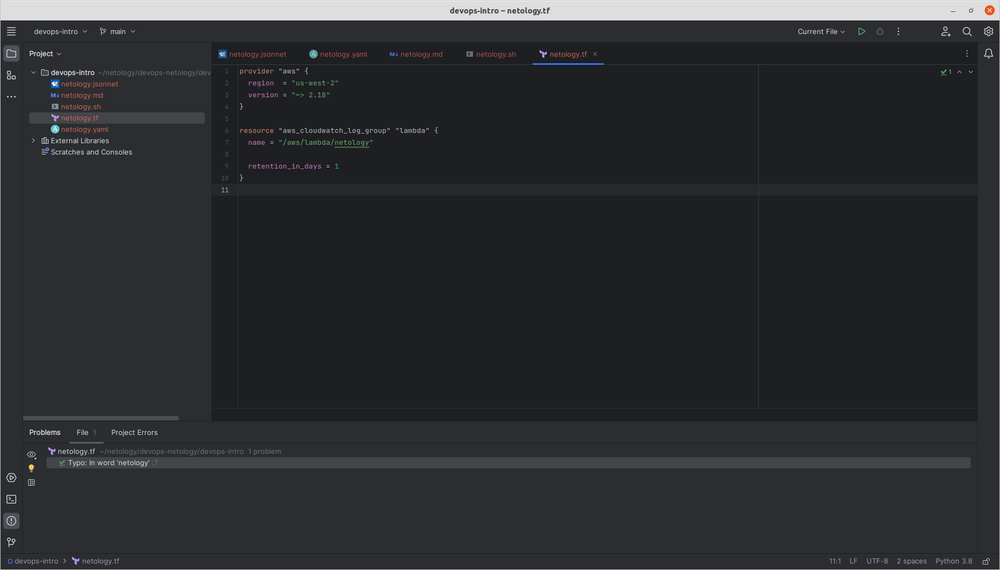
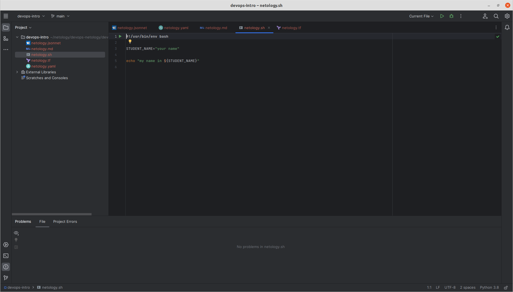
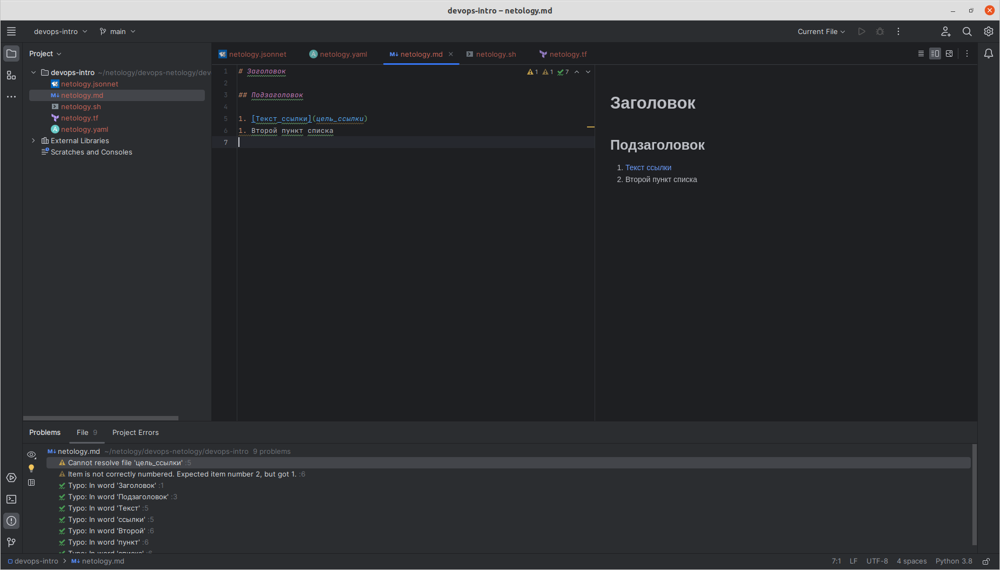
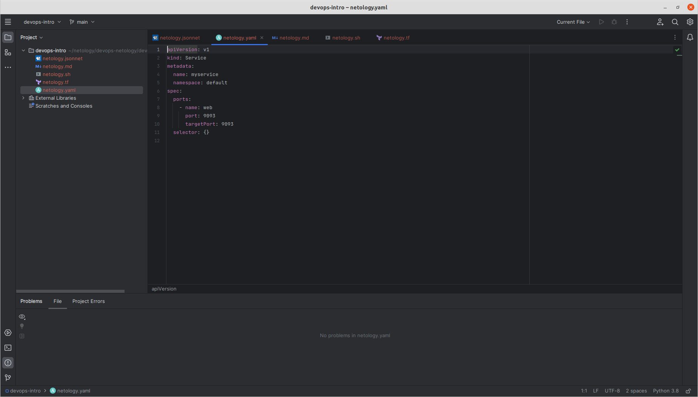
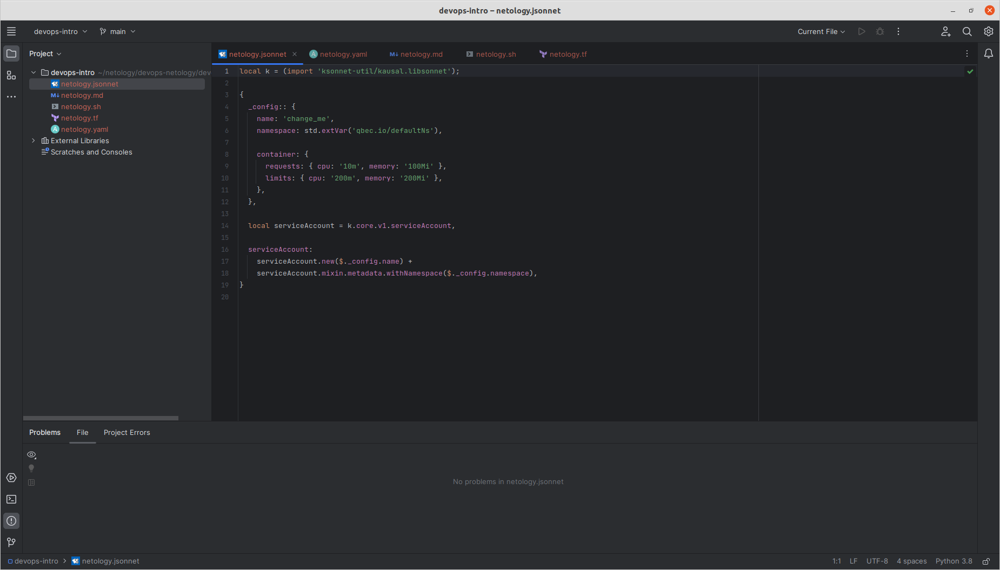

# Решение домашнего задания к занятию «Введение в DevOps»

## Задание 1. Подготовка рабочей среды

---
* Terraform: 
* Bash: 
* Markdown: 
* Yaml: 
* Jsonnet: 
---

## Задание 2. Описание жизненного цикла задачи (разработки нового функционала)

---
Предполагается, что все участники процесса разработки должны тесно сотрудничать, чтобы обеспечить качество ПО, минимизировать время выхода на рынок и удовлетворить требования заказчика. При условии, что описанные ниже шаги выполняются в непрерывном цикле, процесс решения задачи может быть описан следующим образом:

* Сбор требований и создание плана. Менеджер и команда разработчиков собирают требования и создают план разработки. Задача DevOps-инженера в этом этапе - обеспечить процессы автоматизации развертывания, интеграции и тестирования, а также помочь в оценке затрат на разработку и обслуживание ПО.
* Проектирование. Команда разработчиков разрабатывает архитектуру и дизайн ПО, а DevOps-инженер должен обеспечить инфраструктуру для разработки и тестирования ПО, а также настроить автоматическое развертывание приложения на серверах.
* Разработка функционала. Команда разработчиков начинает написание кода, а DevOps-инженеры обеспечивают автоматические тесты, интеграцию и непрерывную доставку ПО. Они также настраивают среду разработки, управление версиями и системы контроля доступа.
* Тестирование. Команда тестировщиков тестирует ПО и сообщает о найденных ошибках. DevOps-инженер обеспечивает быстрое и надежное развертывание ПО на тестовых серверах и автоматические тесты.
* Релиз. Команда разработчиков выпускает ПО, и DevOps-инженер обеспечивает непрерывную доставку (CI/CD), включая настройку автоматического развертывания на серверах продакшена.
* Обслуживание. Команда поддержки продолжает обслуживание ПО, и DevOps-инженеры обеспечивают непрерывную интеграцию, непрерывную доставку и мониторинг приложения в продакшене.
---
