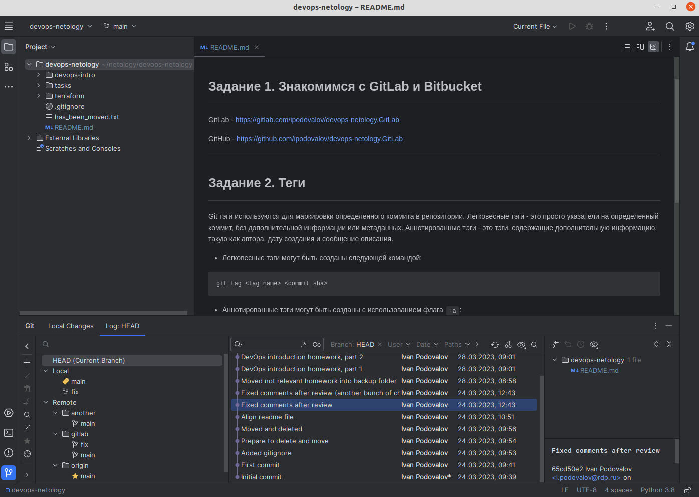

# Решение домашнего задания к занятию «Основы Git»

## Задание 1. Знакомимся с GitLab и Bitbucket

---
GitLab - https://gitlab.com/ipodovalov/devops-netology.GitLab

GitHub - https://github.com/ipodovalov/devops-netology.GitLab

---

## Задание 2. Теги

---
Git тэги используются для маркировки определенного коммита в репозитории. Легковесные тэги - это просто указатели на определенный коммит, без дополнительной информации или метаданных. Аннотированные тэги - это тэги, содержащие дополнительную информацию, такую как автора, дату создания и сообщение описания.

* Легковесные тэги могут быть созданы следующей командой:
```
git tag <tag_name> <commit_sha>
```

* Аннотированные тэги могут быть созданы с использованием флага `-a`:
```
git tag -a <tag_name> <commit_sha> -m "Описание тэга"
```
Флаг -m позволяет добавить описание к тэгу. Это описание будет сохранено вместе с тэгом и может быть просмотрено позже с помощью команды `git show <tag_name>`.

* Наконец, чтобы просмотреть список всех тэгов в репозитории, используйте команду:
```
git tag
```

## Задание 3. Ветки

GitHub - https://github.com/ipodovalov/devops-netology/network/

GitLab - https://gitlab.com/ipodovalov/devops-netology/-/network/main?ref_type=heads

## Задание 4. Упрощаем себе жизнь

* GIT IDE: 
---
