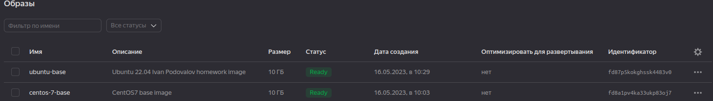
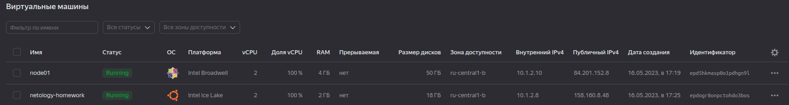
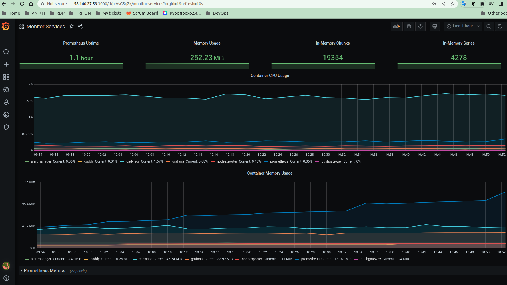

# Домашнее задание "Оркестрация группой Docker контейнеров на примере Docker Compose."

### Задача 1.
> Создать образ с помощью Packer.
> Предоставить скриншот страницы с созданным образом из личного кабинета YandexCloud.



### Задача 2.
> Создать ВМ c помощью WebGUI YandexCloud или с помощью Terraform.
> Предоставить вывод команды terraform apply и страницы свойств, созданной ВМ из личного кабинета YandexCloud.

* 2.1


* 2.2
```bash
17:18 $ terraform apply

Terraform used the selected providers to generate the following execution plan. Resou
  + create

Terraform will perform the following actions:

  # yandex_compute_instance.node01 will be created
  + resource "yandex_compute_instance" "node01" {
      + allow_stopping_for_update = true
      + created_at                = (known after apply)
      + folder_id                 = (known after apply)
      + fqdn                      = (known after apply)
      + gpu_cluster_id            = (known after apply)
      + hostname                  = "node01.netology.cloud"
      + id                        = (known after apply)
      + metadata                  = {
          + "ssh-keys" = <<-EOT
                centos:ssh-rsa <hidden>
            EOT
        }
      + name                      = "node01"
      + network_acceleration_type = "standard"
      + platform_id               = "standard-v1"
      + service_account_id        = (known after apply)
      + status                    = (known after apply)
      + zone                      = "ru-central1-b"

      + boot_disk {
          + auto_delete = true
          + device_name = (known after apply)
          + disk_id     = (known after apply)
          + mode        = (known after apply)

          + initialize_params {
              + block_size  = (known after apply)
              + description = (known after apply)
              + image_id    = "fd89lnd075c7ck5o0e1m"
              + name        = "root-node01"
              + size        = 50
              + snapshot_id = (known after apply)
              + type        = "network-ssd"
            }
        }

      + network_interface {
          + index              = (known after apply)
          + ip_address         = (known after apply)
          + ipv4               = true
          + ipv6               = (known after apply)
          + ipv6_address       = (known after apply)
          + mac_address        = (known after apply)
          + nat                = true
          + nat_ip_address     = (known after apply)
          + nat_ip_version     = (known after apply)
          + security_group_ids = (known after apply)
          + subnet_id          = "e2lnu3od72g2cd2ca7hj"
        }

      + resources {
          + core_fraction = 100
          + cores         = 2
          + memory        = 4
        }
    }

Plan: 1 to add, 0 to change, 0 to destroy.

Changes to Outputs:
  + external_ip_address_node01_yandex_cloud = (known after apply)
  + internal_ip_address_node01_yandex_cloud = (known after apply)

Do you want to perform these actions?
  Terraform will perform the actions described above.
  Only 'yes' will be accepted to approve.

  Enter a value: yes

yandex_compute_instance.node01: Creating...
yandex_compute_instance.node01: Still creating... [10s elapsed]
yandex_compute_instance.node01: Still creating... [20s elapsed]
yandex_compute_instance.node01: Still creating... [30s elapsed]
yandex_compute_instance.node01: Still creating... [40s elapsed]
yandex_compute_instance.node01: Creation complete after 48s [id=epd5hkmasp0o1pdhgn9l]

Apply complete! Resources: 1 added, 0 changed, 0 destroyed.

Outputs:

external_ip_address_node01_yandex_cloud = "84.201.152.8"
internal_ip_address_node01_yandex_cloud = "10.1.2.10"
```

### Задача 3.
> С помощью Ansible и Docker Compose разверните на виртуальной машине
> из предыдущего задания систему мониторинга на основе Prometheus/Grafana.
> Предоставить вывод команды "docker ps"

```shell
[centos@node01 ~]$ sudo docker ps
CONTAINER ID   IMAGE                              COMMAND                  CREATED          STATUS                    PORTS                                                                              NAMES
498488383bb7   prom/pushgateway:v1.2.0            "/bin/pushgateway"       46 minutes ago   Up 46 minutes             9091/tcp                                                                           pushgateway
832299036cf7   prom/node-exporter:v0.18.1         "/bin/node_exporter …"   46 minutes ago   Up 46 minutes             9100/tcp                                                                           nodeexporter
5e5b9bf53000   stefanprodan/caddy                 "/sbin/tini -- caddy…"   46 minutes ago   Up 46 minutes             0.0.0.0:3000->3000/tcp, 0.0.0.0:9090-9091->9090-9091/tcp, 0.0.0.0:9093->9093/tcp   caddy
e50e495f879a   gcr.io/cadvisor/cadvisor:v0.47.0   "/usr/bin/cadvisor -…"   46 minutes ago   Up 46 minutes (healthy)   8080/tcp                                                                           cadvisor
e26e97d0d2c7   grafana/grafana:7.4.2              "/run.sh"                46 minutes ago   Up 46 minutes             3000/tcp                                                                           grafana
819bc8cbab0a   prom/alertmanager:v0.20.0          "/bin/alertmanager -…"   46 minutes ago   Up 46 minutes             9093/tcp                                                                           alertmanager
3b4183ebb37a   prom/prometheus:v2.17.1            "/bin/prometheus --c…"   46 minutes ago   Up 46 minutes             9090/tcp                                                                           prometheus
```

### Задача 4.
> Предоставить скриншот работающего веб-интерфейса Grafana


