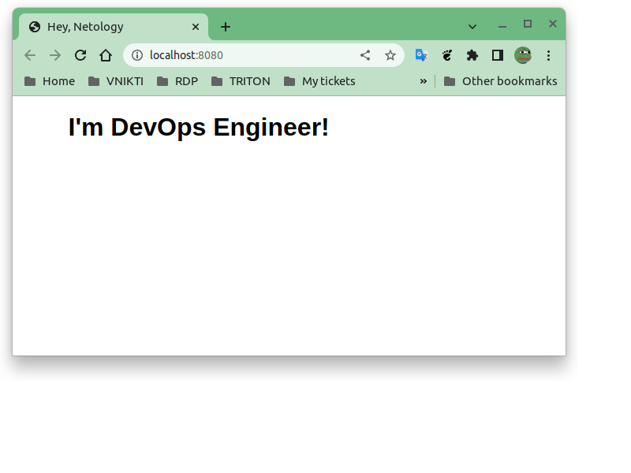
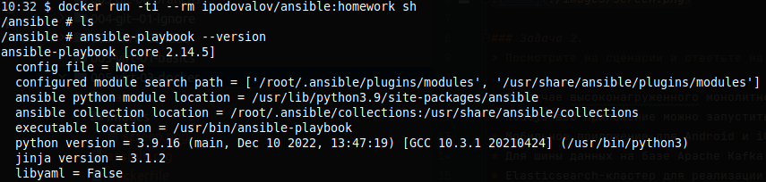

# Домашнее задание к занятию 2. «Применение принципов IaaC в работе с виртуальными машинами»

### Задача 1.
https://hub.docker.com/r/ipodovalov/nginx



### Задача 2.
> Посмотрите на сценарии и ответьте на вопрос: «Подходит ли в этом сценарии использование Docker-контейнеров или лучше подойдёт виртуальная машина, физическая машина? Может быть, возможны разные варианты?»

* В случае высоконагруженного монолитного Java веб-приложения лучше использовать виртуальные машины или физические серверы, так как Java-приложения часто требуют большого объема памяти и вычислительной мощности. Кроме того, на виртуальных машинах можно настроить сетевой балансировщик, который поможет распределять нагрузку на несколько серверов.
* Nodejs веб-приложение можно запустить в Docker-контейнере. Docker позволяет создавать и запускать легковесные контейнеры с необходимыми зависимостями и конфигурацией приложения. Кроме того, Docker легко масштабируется, поэтому его можно использовать для развертывания множества экземпляров приложения.
* Мобильное приложение для Android и iOS не требует непосредственного использования виртуальных машин или физических серверов, поскольку оно запускается на мобильных устройствах. Однако для разработки и тестирования приложения могут потребоваться виртуальные машины или физические серверы.
* Для шины данных на базе Apache Kafka лучше использовать виртуальные машины или физические серверы, поскольку Kafka требует большого объема памяти и вычислительной мощности.
* Elasticsearch-кластер для реализации логирования продуктивного веб-приложения можно развернуть в Docker-контейнерах, так как Docker обеспечивает легкое масштабирование и управление контейнерами.
* Мониторинг-стек на базе Prometheus и Grafana можно развернуть в Docker-контейнерах. Docker позволяет легко настраивать и управлять контейнерами с микросервисами.
* MongoDB как основное хранилище данных для Java-приложения можно развернуть на виртуальных машинах или физических серверах. MongoDB требует большого объема памяти и вычислительной мощности.
* Gitlab-сервер для реализации CI/CD-процессов и приватный (закрытый) Docker Registry можно развернуть в Docker-контейнерах.

### Задача 3.
* Логи с практики:  

    ```shell
    ✔ ~/netology/devops-netology/tasks/005-virt-03-docker [main L|✚ 1…1] 
    09:53 $ mkdir -p data
    ✔ ~/netology/devops-netology/tasks/005-virt-03-docker [main L|✚ 1…1] 
    09:53 $ docker run -it --rm -d -v ./data:/data/ centos
    4111147cfaf38c998e48548828ab7454a94d945557ecbe3be775d75d02926a67
    ✔ ~/netology/devops-netology/tasks/005-virt-03-docker [main L|✚ 1…1] 
    09:54 $ docker run -it --rm -d -v ./data:/data/ debian
    a156a2dffd5ed081838357e23b2753ac6af9c91fdf4e8d289dd4d8bd8b75e7b5
    ✔ ~/netology/devops-netology/tasks/005-virt-03-docker [main L|✚ 1…1] 
    09:56 $ docker ps
    CONTAINER ID   IMAGE     COMMAND       CREATED          STATUS          PORTS     NAMES
    a156a2dffd5e   debian    "bash"        22 seconds ago   Up 21 seconds             elated_noyce
    4111147cfaf3   centos    "/bin/bash"   2 minutes ago    Up 2 minutes              jolly_meninsky
    ✔ ~/netology/devops-netology/tasks/005-virt-03-docker [main L|✚ 1…1]
    09:56 $ docker exec -ti 4111147cfaf3 bash
    [root@4111147cfaf3 /]# ls -l /data/
    total 0
    [root@4111147cfaf3 /]# echo HELLO > /data/hello.txt
    [root@4111147cfaf3 /]# exit
    exit
    ✔ ~/netology/devops-netology/tasks/005-virt-03-docker [main L|✚ 1…1] 
    09:58 $ echo BYE > data/bye.txt
    ✔ ~/netology/devops-netology/tasks/005-virt-03-docker [main L|✚ 1…1] 
    09:58 $ docker exec -ti a156a2dffd5e bash
    root@a156a2dffd5e:/# ls -l /data
    total 8
    -rw-rw-r-- 1 1001 1001 4 May 15 06:58 bye.txt
    -rw-r--r-- 1 root root 6 May 15 06:57 hello.txt
    root@a156a2dffd5e:/# cat /data/*
    BYE
    HELLO
    root@a156a2dffd5e:/# 
    ```

### Задача 4.
https://hub.docker.com/r/ipodovalov/ansible


