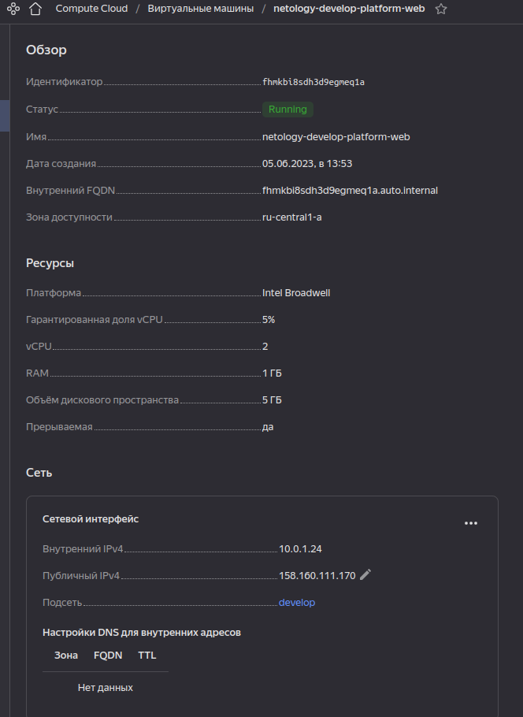
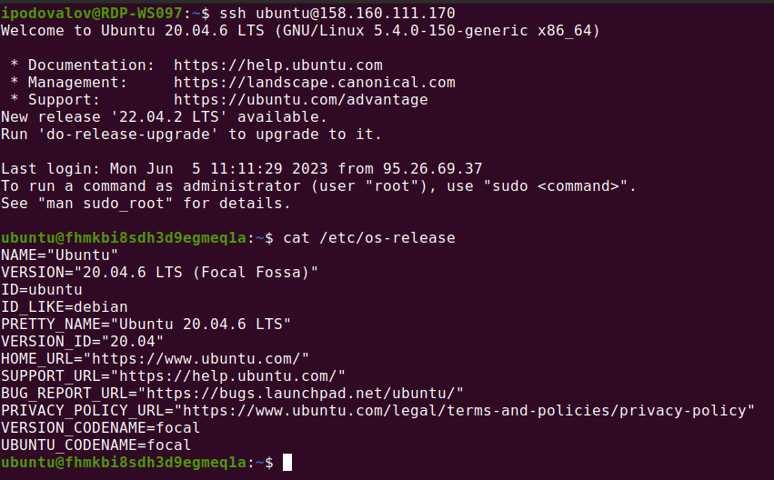

# Домашнее задание "Основы работы с Terraform"

### Задание 0.
**Выполнено**

### Задание 1.
> Инициализируйте проект, выполните код. Исправьте возникшую ошибку. Ответьте в чем заключается ее суть?

**Ошибка была такая:**
```shell
╷
│ Error: Error while requesting API to create instance: server-request-id = 76d4eeb7-b48c-48c6-8098-48a123e18e6a server-trace-id = 31c303381a6402d9:fb70a1c79444bf06:31c303381a6402d9:1 client-request-id = 78a2cbdb-d463-49f8-958d-63c43545937a client-trace-id = 6a14c153-bd9a-4f5f-a56c-011c13717753 rpc error: code = InvalidArgument desc = the specified number of cores is not available on platform "standard-v1"; allowed core number: 2, 4
│
│   with yandex_compute_instance.platform,                                                                             
│   on main.tf line 16, in resource "yandex_compute_instance" "platform":                                              
│   16: resource "yandex_compute_instance" "platform" {                                                                
│                                                                                                                      
╵                                                                                                                      
```
она означает, что провайдер облака (яндекс-клауд) для платформ standard-v1 не  
предоставляет виртуальные машины с количеством ядер процессора равным 1. То есть, 
хотя с точки зрения `terraform plan` код корректный, мы не можем запросить виртуалку
с одноядерным процессором из-за правил облачного провайдера.

> Ответьте, как в процессе обучения могут пригодиться параметрыpreemptible = true и core_fraction=5 в параметрах ВМ?  

**Ответ:**  
параметр `preemtible = true` указывает провайдеру [сделать виртуальную машину прерываемой](https://cloud.yandex.ru/docs/compute/operations/vm-create/create-preemptible-vm#create-preemptible), а параметр `core_fraction=5` определяет [уровень производительности vCPU в процентах](https://cloud.yandex.ru/docs/compute/concepts/performance-levels), что в учебных целях не так существенно, зато поможет **сэкономить деньги**.

Скриншоты:



### Задание 2.
> Проверьте terraform plan (изменений быть не должно).

**Изменений нет**

### Задание 3.

