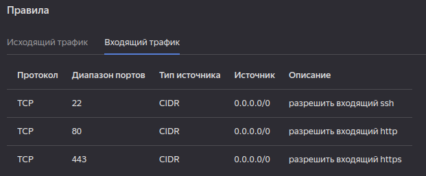

# Домашнее задание "Управляющие конструкции в коде Terraform"

### Задание 1.

> Приложите скриншот входящих правил "Группы безопасности" в ЛК Yandex Cloud  
  

### Задание 2.

> 1. Создайте файл count-vm.tf. Опишите в нем создание двух одинаковых ВМ web-1 и web-2(не web-0 и web-1!), с минимальными параметрами, используя мета-аргумент `count loop`. Назначьте ВМ созданную в 1-м задании группу безопасности.  
**Выполнено** (см. [коммит](https://github.com/ipodovalov/devops-netology/commit/d2eded7b463603cf24cd28780ccaf36d6a06d286)).

> 2. Создайте файл `for_each-vm.tf`. Опишите в нем создание 2 ВМ с именами "main" и "replica" разных по cpu/ram/disk , используя мета-аргумент `for_each loop`. Используйте переменную типа `list(object({ vm_name=string, cpu=number, ram=number, disk=number }))`. При желании внесите в переменную все возможные параметры.  
**Выполнено** (см. [коммит](https://github.com/ipodovalov/devops-netology/commit/c50218b0242de0fa9ade5ee69664bf3b4f26a9cd)).

> 3. ВМ из пункта 2.2 должны создаваться после создания ВМ из пункта 2.1.  
**Выполнено** (см. [коммит](https://github.com/ipodovalov/devops-netology/commit/2483f203e26d571c5cb12d116ba4af7afc48f3f8)).

> 4. Используйте функцию file в local переменной для считывания ключа `~/.ssh/id_rsa.pub` и его последующего использования в блоке metadata, взятому из ДЗ №2.  
**Выполнено** (см. [коммит](https://github.com/ipodovalov/devops-netology/commit/f7da8dc49828cdc2dca748ee83b04ee55b2b51b9)).

> 5. Инициализируйте проект, выполните код.  
**Выполнено**

### Задание 3.

> 1. Создайте 3 одинаковых виртуальных диска, размером 1 Гб с помощью ресурса `yandex_compute_disk` и мета-аргумента `count` в файле `disk_vm.tf`.  
**Выполнено** (см. [коммит](https://github.com/ipodovalov/devops-netology/commit/254cb4391e13699f6397931471ec8e18ab6ddebd)).

> 2. Создайте в том же файле одну ВМ c именем "storage". Используйте блок dynamic `secondary_disk{..}` и мета-аргумент `for_each` для подключения созданных вами дополнительных дисков.  
**Выполнено** (см. [коммит](https://github.com/ipodovalov/devops-netology/commit/9b9517cc32073e08c949b33bbdaea4cd4a4a113a)).

### Задание 4.

> 1. В файле `ansible.tf` создайте `inventory-файл` для `ansible`. Используйте функцию `tepmplatefile` и файл-шаблон для создания `ansible` inventory-файла из лекции. Готовый код возьмите из демонстрации к лекции [demonstration2](https://github.com/netology-code/ter-homeworks/tree/main/demonstration2). Передайте в него в качестве переменных группы виртуальных машин из задания 2.1, 2.2 и 3.2.(т.е. 5 ВМ).  
**Выполнено** (см. [коммит](https://github.com/ipodovalov/devops-netology/commit/9e42f84adca25b17163ab48d1187802189f7cad2)).

> 2. Инвентарь должен содержать 3 группы `[webservers]`, `[databases]`, `[storage]` и быть динамическим, т.е. обработать как группу из 2-х ВМ так и 999 ВМ.  
**Выполнено** (см. [коммит](https://github.com/ipodovalov/devops-netology/commit/9e42f84adca25b17163ab48d1187802189f7cad2)).

> 3. Выполните код. Приложите скриншот получившегося файла.  
```shell
[webservers]                          
web-1   ansible_host=130.193.50.81    
web-2   ansible_host=158.160.62.162   
                                      
[databases]                           
main   ansible_host=158.160.107.147   
replica   ansible_host=158.160.106.180
                                      
[storage]                             
storage   ansible_host=158.160.46.87  
```
