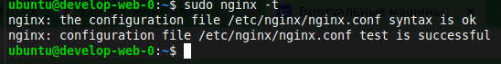
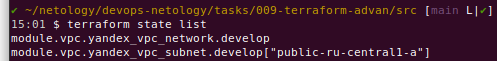
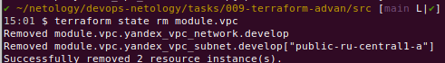
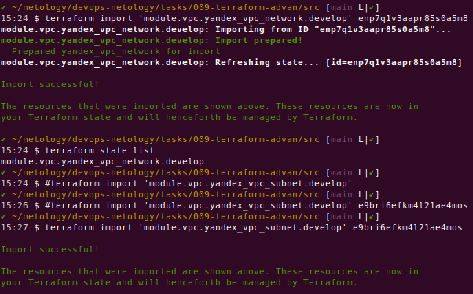

# Домашнее задание "Продвинутые методы работы с Terraform"

### Задание 1.

> 1. Возьмите из [демонстрации к лекции](https://github.com/netology-code/ter-homeworks/tree/main/04/demonstration1) готовый код для создания ВМ с помощью remote модуля.  
**Выполнено** (см. [коммит](https://github.com/ipodovalov/devops-netology/commit/212888c)).

> 2. Создайте 1 ВМ, используя данный модуль. В файле `cloud-init.yml` необходимо использовать переменную для ssh ключа вместо хардкода. Передайте ssh-ключ в функцию `template_file` в блоке `vars={}`. Воспользуйтесь [примером](https://grantorchard.com/dynamic-cloudinit-content-with-terraform-file-templates/). Обратите внимание что ssh-authorized-keys принимает в себя список, а не строку!  
**Выполнено** (см. [коммит](https://github.com/ipodovalov/devops-netology/commit/454a7a2)).

> 3. Добавьте в файл cloud-init.yml установку nginx.  
**Выполнено** (см. [коммит](https://github.com/ipodovalov/devops-netology/commit/819497e)).

> 4. Предоставьте скриншот подключения к консоли и вывод команды `sudo nginx -t`.  
**Выполнено**   

### Задание 2.

> 1. Напишите локальный модуль vpc, который будет создавать 2 ресурса: **одну** сеть и **одну** подсеть в зоне, объявленной при вызове модуля. например: `ru-central1-a`.  
**Выполнено** (см. [коммит](https://github.com/ipodovalov/devops-netology/commit/7ecc2d4)).

> 2. Модуль должен возвращать значения `vpc.id` и `subnet.id`  
**Выполнено** (см. [коммит](https://github.com/ipodovalov/devops-netology/commit/4bbfe1e)).

> 3. Замените ресурсы `yandex_vpc_network` и `yandex_vpc_subnet`, созданным модулем.  
**Выполнено** (см. [коммит](https://github.com/ipodovalov/devops-netology/commit/c8c19d3)).

> 4. Сгенерируйте документацию к модулю с помощью terraform-docs.  
**Выполнено** (см. [коммит](https://github.com/ipodovalov/devops-netology/commit/e7451fb)).

### Задание 3.

> 1. Выведите список ресурсов в стейте.  
**НЕВыполнено**  

> 2. Удалите из стейта модуль vpc.  
**НЕВыполнено**  

> 3. Импортируйте его обратно. Проверьте terraform plan - изменений быть не должно. Приложите список выполненных команд и вывод.  
**НЕВыполнено**  

