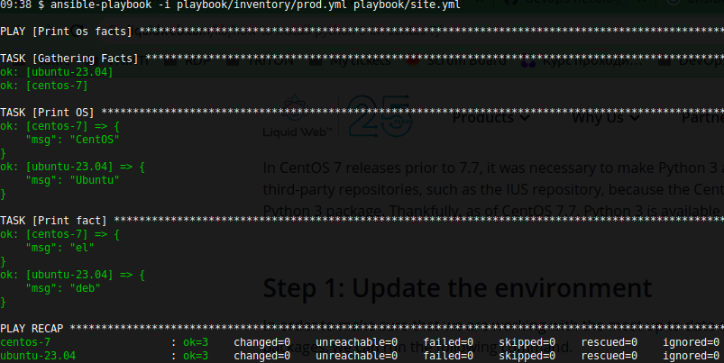
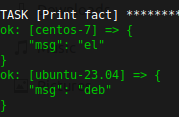
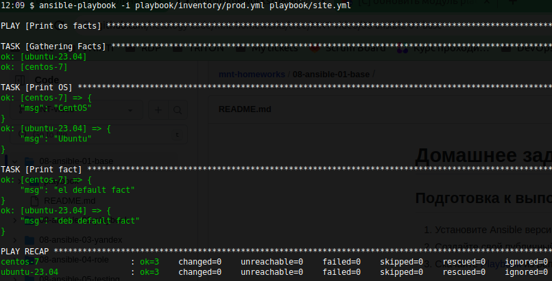
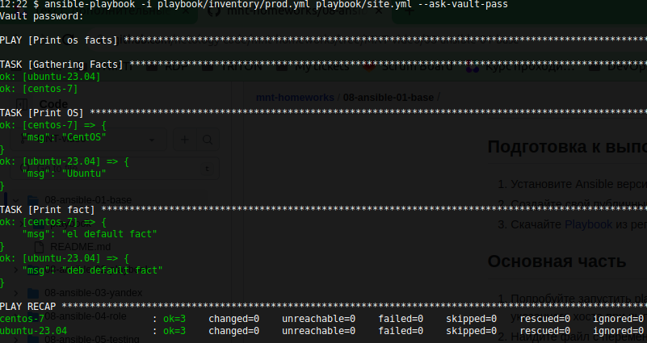
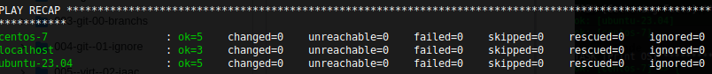

# Домашнее задание "Введение в Ansible"

### Основная часть.

> 1. Попробуйте запустить `playbook` на окружении из `test.yml`, зафиксируйте значение, которое имеет факт `some_fact` для указанного хоста при выполнении `playbook`.  
**Выполнено** (см. [коммит](https://github.com/ipodovalov/devops-netology/commit/5746581)).

> 2. Найдите файл с переменными (`group_vars`), в котором задаётся найденное в первом пункте значение, и поменяйте его на `all default fact`.  
**Выполнено** (см. [коммит](https://github.com/ipodovalov/devops-netology/commit/1852234)).

> 3. Воспользуйтесь подготовленным (используется `docker`) или создайте собственное окружение для проведения дальнейших испытаний.  
**Выполнено** (см. [коммит](https://github.com/ipodovalov/devops-netology/commit/714442c)).  

> 4. Проведите запуск `playbook` на окружении из `prod.yml`. Зафиксируйте полученные значения `some_fact` для каждого из `managed host`.  
**Выполнено** (см. [коммит](https://github.com/ipodovalov/devops-netology/commit/a455b7c)).  

> 5. Добавьте факты в `group_vars` каждой из групп хостов так, чтобы для `some_fact` получились значения: для `deb` — `deb default fact`, для `el` — `el default fact`.  
**Выполнено** (см. [коммит](https://github.com/ipodovalov/devops-netology/commit/3171c52)).

> 6. Повторите запуск `playbook` на окружении `prod.yml`. Убедитесь, что выдаются корректные значения для всех хостов.  
**Выполнено** (см. [коммит](https://github.com/ipodovalov/devops-netology/commit/3171c52)).  

> 7. При помощи `ansible-vault` зашифруйте факты в `group_vars/deb` и `group_vars/el` с паролем netology.  
**Выполнено** (см. [коммит](https://github.com/ipodovalov/devops-netology/commit/21dac58)).

> 8. Запустите `playbook` на окружении `prod.yml`. При запуске `ansible` должен запросить у вас пароль. Убедитесь в работоспособности.  
**Выполнено** (см. [коммит](https://github.com/ipodovalov/devops-netology/commit/21dac58)).

> 9. Посмотрите при помощи `ansible-doc` список плагинов для подключения. Выберите подходящий для работы на `control node`.  
**Выполнено** (см. [коммит](https://github.com/ipodovalov/devops-netology/commit/b5babe0)).

> 10. В `prod.yml` добавьте новую группу хостов с именем `local`, в ней разместите `localhost` с необходимым типом подключения.  
**Выполнено** (см. [коммит](https://github.com/ipodovalov/devops-netology/commit/25c879a)).

> 11. Запустите `playbook` на окружении `prod.yml`. При запуске `ansible` должен запросить у вас пароль. Убедитесь, что факты `some_fact` для каждого из хостов определены из верных `group_vars`.  
**Выполнено** (см. [коммит](https://github.com/ipodovalov/devops-netology/commit/25c879a)).

> 12. Заполните `README.md` ответами на вопросы. Сделайте `git push` в ветку master. В ответе отправьте ссылку на ваш открытый репозиторий с изменённым `playbook` и заполненным `README.md`.  
**НЕВыполнено** (см. [коммит](https://github.com/ipodovalov/devops-netology/commit/)).
